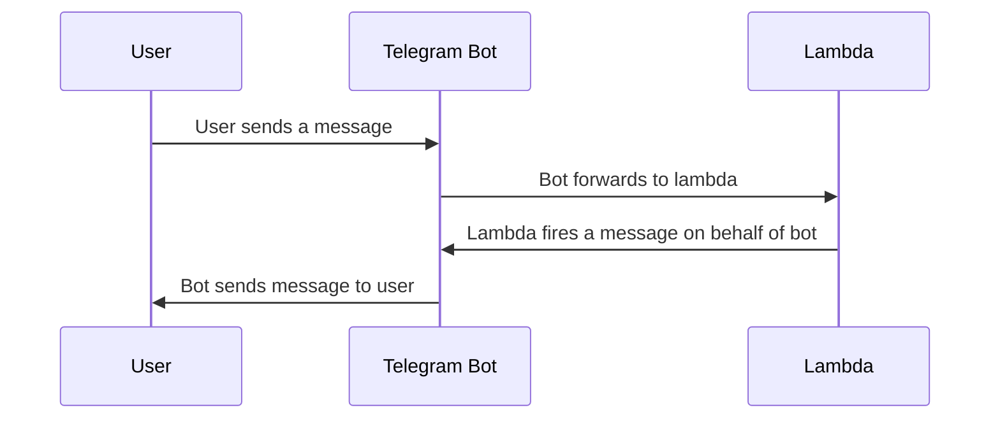

# telegram-boggle-bot ([t.me/mabooriqueBot](https://t.me/mabooriqueBot))
This bot was made in order to help during boggle trainings, and provide an easy way for players to find solutions to a boggle board

This bot was written in python, and deployed through lambda. Then lambda function handler URL is then registered to a telegram bot webhook.

## Commands
`/start`: Initializes the bot and provides instructions on how to use the bot    
  
`/help`: Provides instructions on how to use the bot    
  
`/solve [16 letter characters]`: Provides solution to the boggle board defined using the 16 letter words

### How to Use (`/help`)
```
Please type /solve followed by a space and 16 letters
Example:
/solve abcdefghijklmnop

gives a solution to the following board
 a b c d 
 e f g h 
 i j k l 
 m n o p

Use 'q' for the 'Qu' tile
```
## Flow

## Example


## Performance comparison
Below are some performance comparison when reading the txt.file and generating trie, versus preprocessing the trie and dumping into a json file as well as pickling the trie.

Size comparison:
txt.file    : 2.8 MB
json file   : 63.4 MB
pickle file : 7.2 MB

Time comparison (local):
Time to read txt file and create trie : 0.34801197052001953 seconds
Time to read trie JSON file           : 0.4533710479736328 seconds
Time to read trie pickle file         : 0.26566505432128906 seconds

Time comparison (lambda):
Time to read txt file and create trie : 2.9494423866271973 seconds
Time to read trie JSON file           : 6.081415891647339 seconds
Time to read trie pickle file         : 2.757767677307129 seconds

Summary: pickling is the fastest, but with 3 times the storage of txt file
